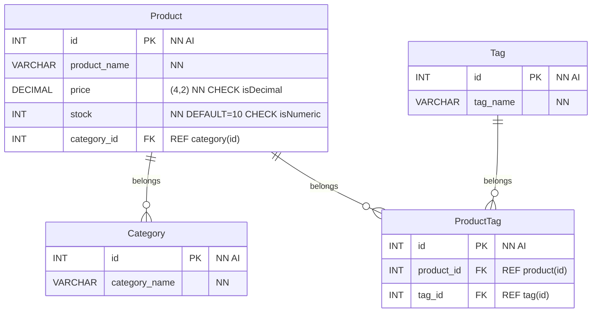

# E-commerce Back End Starter Code

## User Story

```text
AS A manager at an internet retail company
I WANT a back end for my e-commerce website that uses the latest technologies
SO THAT my company can compete with other e-commerce companies
```

## Acceptance Criteria

```text
GIVEN a functional Express.js API
WHEN I add my database name, MySQL username, and MySQL password to an environment variable file
THEN I am able to connect to a database using Sequelize
WHEN I enter schema and seed commands
THEN a development database is created and is seeded with test data
WHEN I enter the command to invoke the application
THEN my server is started and the Sequelize models are synced to the MySQL database
WHEN I open API GET routes in Insomnia Core for categories, products, or tags
THEN the data for each of these routes is displayed in a formatted JSON
WHEN I test API POST, PUT, and DELETE routes in Insomnia Core
THEN I am able to successfully create, update, and delete data in my database
```

## ER Diagram

A few things to note, there are some non-standard acronyms in this diagram.

| Abbr | Short for  | Meaning |
|------|------------|---------|
| `NN` | `NOT NULL` | Value is required |
| `AI` | `AUTO_INCREMENT` | Value will be assigned a static integer |
| `REF table(col)` | `REFERENCE table(col)` | Used with a foreign key, this indicates the table and column that foreign key refers to. |
| `CHECK name` | `CONSTRAINT name CHECK ...` | Indicates where a constraint will need to be applied. We could use a function if we write one.

> NOTE: My understanding of ER associations is still a bit new.



It might be better to apply validation in JavaScript rather than SQL. SQL could do it, but the data would need to be treated as strings and compared with regular expressions.